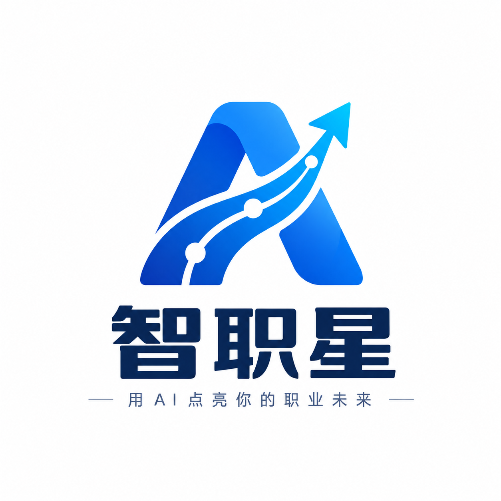
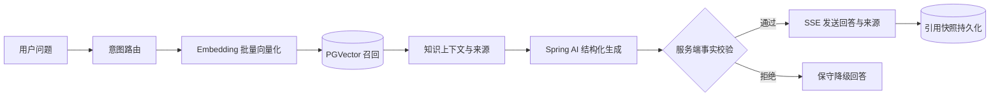
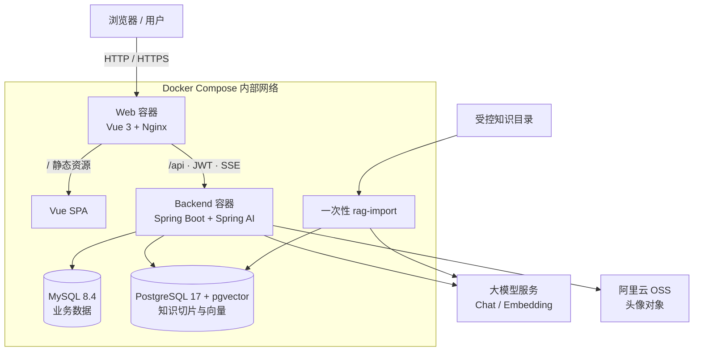

<div align="center">
  

  <h1>智职星 · 大学生智能职业成长平台</h1>

  <p><strong>用 AI 点亮职业未来，让每一次规划、学习与面试都有迹可循。</strong></p>

  <p>
    面向大学生的一站式职业成长平台，将职业画像、智能规划、成长任务、模拟面试、能力评估与持续迭代连接成完整闭环。
  </p>

  <p>
    
    
    
    
    
    
    
    
  </p>
</div>

---

## 项目简介

智职星不是一个只会回答问题的聊天机器人，而是一套围绕大学生职业成长打造的智能业务系统。平台把用户的教育背景、技能、兴趣和目标沉淀为职业画像，再由 AI 职业规划师生成个性化建议和成长路线；用户完成任务、参加模拟面试后，新的能力证据会继续进入成长分析，推动下一轮规划。

```text
职业画像 → AI 职业规划 → 成长任务 → AI 模拟面试 → 能力评估 → 动态再规划
    ↑                                                            ↓
    └────────────────────── 持续成长闭环 ────────────────────────┘
```

项目既覆盖完整的前后端业务链路，也实现了可追溯 RAG、真实 SSE、受约束 Tool Calling、事实校验、会话记忆和面向 2 核 2 GB Linux 主机的全容器化部署。

## 核心能力

| 模块 | 已实现能力 |
|---|---|
| 账户与安全 | 用户注册、登录、JWT 认证、用户数据隔离 |
| 职业画像 | 教育信息、职业兴趣、目标方向、技能与熟练度管理 |
| 智能 Dashboard | 成长概览、任务进度、能力快照、近期面试与快捷入口 |
| AI 职业规划师 | 普通对话、SSE 流式回复、会话管理、历史恢复、个性化职业建议 |
| 职业规划 | 优势与短板分析、阶段路线、任务拆解、历史版本 |
| 成长任务 | 任务列表、优先级、状态流转、完成率统计 |
| AI 模拟面试 | 岗位与难度配置、动态追问、主动或自动结束、消息留痕 |
| 面试报告 | 综合评分、分项评分、优劣势分析、改进建议、能力雷达图 |
| 成长分析 | 能力评分、变化趋势、历史面试与成长反馈 |
| RAG 知识库 | 受控知识导入、语义检索、多意图召回、来源卡片、引用快照、故障降级 |
| Tool Calling | 查询成长任务、能力评分、近期面试；服务端绑定用户身份与逐字证据校验 |
| 文件存储 | 阿里云 OSS 头像上传、替换与旧对象清理，支持 JPG/PNG/WebP/GIF，最大 5 MB |

## 亮点设计

### 1. 从“生成答案”到“交付可信答案”

普通 RAG 往往只把检索片段塞进 Prompt，然后直接相信模型输出。智职星在生成后增加了服务端事实闸门：模型先生成结构化草稿，知识事实必须携带本轮片段编号与逐字证据，后端确认这些证据确实来自本轮 Prompt 后才允许发送。

这条链路可以避免模型伪造来源、引用旧轮证据，或把未经测量的性能数字包装成用户已经取得的成果。



### 2. RAG、业务事实与会话记忆严格分层

系统明确区分三类上下文，避免把向量检索当成万能数据库：

- **业务事实**：画像、技能、任务、规划和面试记录从 MySQL 实时读取；
- **会话记忆**：当前会话上下文与历史消息独立持久化；
- **知识上下文**：岗位能力、成长路线和求职方法等受控知识进入 pgvector。

RAG 只在问题确实需要职业知识时触发。无结果、超时、Embedding 或 PostgreSQL 暂时不可用时，聊天链路会安全降级，不伪造引用，也不让外部 AI 服务波动触发容器重启。

### 3. 只读、受约束的 Tool Calling

职业规划师基于 Spring AI `@Tool`、`ChatClient.tools(...)` 与 `ToolContext` 实现三类只读工具：

- 当前成长任务与完成情况；
- 能力评分快照与有限历史变化；
- 最近模拟面试和报告摘要。

安全边界并不交给模型决定：认证用户 ID 只由服务端通过 `ToolContext` 注入，模型参数中不存在 `userId`；每次调用生成独立证据 ID，最终事实必须与真实工具结果逐字一致。创建任务、修改画像、保存规划等写操作仍由确定性的业务 Service 负责，当前没有向模型开放写工具。

### 4. 真实 SSE 阶段，而非前端动画

职业规划师通过 SSE 推送真实执行阶段。只有后端实际开始知识检索时，前端才会展示 `KNOWLEDGE_RETRIEVAL`；进入生成后推送 `GENERATING`；完成事件携带本轮真实 `ragApplied` 状态和结构化来源。Nginx 对 `/api/**` 关闭代理缓冲，并为长连接保留 180 秒读写超时。

### 5. 面向低配云服务器的工程化交付

项目可在 **2 核 2 GB 内存 + 至少 2 GB Swap** 的 Linux 服务器部署。服务器只需 Docker Engine 和 Docker Compose Plugin，不需要单独安装 Java、Maven、Node、npm、MySQL 或 PostgreSQL。

- 后端、前端均使用多阶段构建，JAR 与 `dist` 在镜像内产生；
- Java 与 Nginx 运行阶段均使用非 root 用户；
- MySQL、pgvector、JVM、连接池和构建过程均做了低内存约束；
- 只向公网发布 Web 端口，8080、3306、5432 仅在 Compose 网络内可见；
- 数据库使用命名卷持久化，更新和回滚不会删除数据卷；
- Docker 日志自动轮转，避免日志无限占满磁盘；
- `application-local.yml`、`.env`、源码依赖和构建产物均有多层防泄漏检查。

## 系统架构



### 数据流与信任边界

| 数据 | 存储位置 | 使用方式 |
|---|---|---|
| 用户、画像、技能、规划、任务、面试 | MySQL | 业务 Service 与只读 Tool 精确查询 |
| 聊天会话、消息、引用快照 | MySQL | 会话恢复、幂等回放、引用审计 |
| 职业知识切片与向量 | PostgreSQL + pgvector | RAG 语义检索与版本过滤 |
| 用户头像 | 阿里云 OSS | 受限类型与大小上传，替换时清理旧对象 |
| 密钥和数据库密码 | 服务器 `.env` | 仅运行时注入，不进入 Git 和镜像 |

## 技术栈

### 后端

| 技术 | 用途 |
|---|---|
| Java 21 | 后端运行时与虚拟线程并发检索 |
| Spring Boot 4.0.8 | Web、配置、校验、Actuator 与应用生命周期 |
| Spring AI 2.0.1 | ChatClient、EmbeddingModel、Chat Memory、结构化输出、Tool Calling |
| MyBatis-Plus 3.5.17 | 业务数据访问 |
| MySQL 8.4 | 核心业务数据、会话与引用快照 |
| PostgreSQL 17 + pgvector 0.8.6 | 职业知识向量检索 |
| Flyway | 数据库版本迁移 |
| JJWT 0.13 | JWT 签发与认证 |
| Springdoc + Knife4j | 开发环境 API 文档，生产环境关闭 |
| Aliyun OSS SDK | 用户头像对象存储 |

### 前端

| 技术 | 用途 |
|---|---|
| Vue 3.5 + TypeScript 5.9 | 组件化应用与类型约束 |
| Vite 8 | 开发服务器与生产构建 |
| Vue Router 5 | History 路由与鉴权守卫 |
| Pinia 4 | 用户态和全局状态管理 |
| Axios | API 请求与 JWT 拦截 |
| Element Plus | 企业蓝白风 UI 组件体系 |
| ECharts 6 | 能力雷达图和成长趋势 |
| markdown-it + DOMPurify | AI Markdown 展示与内容净化 |

### 部署与运维

| 技术 | 用途 |
|---|---|
| Docker + Docker Compose | 全栈服务编排与一键部署 |
| Nginx Unprivileged | SPA 静态托管、API 反向代理、SSE 转发 |
| Maven / Node 22 多阶段构建 | 在镜像内完成 JAR 与前端 `dist` 构建 |
| Spring Boot Actuator | 仅公开健康检查端点 |

## 项目结构

```text
ai-career/
├── ai-career-server/              # Spring Boot 后端
│   ├── src/main/java/             # Controller / Service / Mapper / Agent / RAG / Tool
│   ├── src/main/resources/
│   │   ├── db/migration/          # Flyway 迁移
│   │   ├── application.yml        # 公共配置
│   │   └── application-prod.yml   # 纯环境变量生产配置
│   └── Dockerfile                 # Maven + JDK 21 / JRE 21 多阶段镜像
├── ai-career-web/                 # Vue 3 前端
│   ├── src/api/                   # API 封装
│   ├── src/views/                 # 业务页面
│   ├── src/stores/                # Pinia 状态
│   ├── nginx/default.conf         # 生产反向代理与 SPA 配置
│   └── Dockerfile                 # Node 22 / Nginx 多阶段镜像
├── deploy/                        # 部署、更新、RAG 导入、回滚脚本
├── docs/                          # PRD、API、数据库、Agent、RAG、UI 与部署文档
│   └── 知识库/                    # 受控 Markdown 知识、清单与评测材料
├── compose.yaml                   # MySQL + pgvector + backend + web + rag-import
├── .env.production.example       # 无真实密钥的生产变量模板
└── .dockerignore                 # 构建上下文安全边界
```

## 快速开始：Docker 一键部署

> 推荐使用该方式。以下命令在 Linux 服务器的仓库根目录执行。

### 1. 服务器准备

建议配置：

- 64 位 Linux；
- 2 核 CPU、2 GB 内存；
- **至少 2 GB Swap**；
- Docker Engine；
- Docker Compose Plugin；
- 可访问所配置的大模型、Embedding 与 OSS 服务；
- 安全组/防火墙开放 SSH 和 Web 端口，**不要对公网开放 8080、3306、5432**。

检查环境：

```bash
docker --version
docker compose version
free -h
```

若服务器还没有 Swap，可参考：

```bash
sudo fallocate -l 2G /swapfile
sudo chmod 600 /swapfile
sudo mkswap /swapfile
sudo swapon /swapfile
echo '/swapfile none swap sw 0 0' | sudo tee -a /etc/fstab
```

已有足量 Swap 时不要重复创建。

### 2. 创建生产配置

```bash
cp .env.production.example .env
nano .env
```

至少需要填写以下敏感项，全部使用自己的真实配置，不要把 `.env` 提交到 Git：

| 变量 | 说明 |
|---|---|
| `MYSQL_ROOT_PASSWORD` | MySQL 容器 root 强密码，仅用于初始化与备份 |
| `DB_PASSWORD` | 后端专用 MySQL 用户密码 |
| `POSTGRES_PASSWORD` | pgvector 数据库密码 |
| `RAG_PG_PASSWORD` | 与 `POSTGRES_PASSWORD` 保持一致 |
| `AI_API_KEY` | 聊天模型 API Key |
| `RAG_EMBEDDING_API_KEY` | Embedding API Key，可与聊天 Key 相同但需显式填写 |
| `JWT_SECRET` | 至少 32 字符的随机密钥，上线后不要随意更换 |
| `OSS_ACCESS_KEY_ID` | OSS 最小权限 RAM AccessKey ID |
| `OSS_ACCESS_KEY_SECRET` | OSS 最小权限 RAM AccessKey Secret |

同时确认模型和地址：`AI_BASE_URL`、`AI_MODEL`、`RAG_EMBEDDING_BASE_URL`、`RAG_EMBEDDING_MODEL`、`OSS_ENDPOINT`、`OSS_BUCKET_NAME`。

### 3. 首次部署

```bash
bash deploy/deploy.sh --import-rag
```

这条命令会顺序完成环境校验、Compose 配置校验、后端镜像构建、前端镜像构建、镜像内容安全检查、数据库启动、一次性知识导入、后端启动和 Web 健康检查。顺序构建可以降低 2 GB 主机发生 OOM 的概率。

部署完成后访问：

```text
http://<服务器公网 IP>
```

### 4. 验证服务

```bash
docker compose --env-file .env ps
curl -fsS http://127.0.0.1/healthz
curl -I http://127.0.0.1/login
```

正常情况下，`mysql`、`pgvector`、`backend`、`web` 都应显示为 `healthy`。

### 首次部署、普通更新与知识更新

| 场景 | 命令 | 是否导入 RAG | 是否删除数据卷 |
|---|---|---:|---:|
| 首次上线 | `bash deploy/deploy.sh --import-rag` | 是 | 否 |
| 使用服务器当前代码更新 | `bash deploy/update.sh` | 否 | 否 |
| 先拉取远端再更新 | `bash deploy/update.sh --pull` | 否 | 否 |
| 知识文档版本更新 | `bash deploy/import-rag.sh` | 是 | 否 |
| 回滚应用镜像 | `bash deploy/rollback.sh` | 否 | 否 |
| 回滚到指定镜像 | `bash deploy/rollback.sh <APP_VERSION>` | 否 | 否 |

`rag-import` 是一次性任务，成功后退出；普通后端固定使用 `AI_RAG_IMPORT=false`，因此服务重启和日常更新不会重复调用 Embedding。

完整生产说明、备份、预构建镜像和 HTTPS 接入方式请阅读：[生产部署说明](./docs/%E9%83%A8%E7%BD%B2/%E7%94%9F%E4%BA%A7%E9%83%A8%E7%BD%B2%E8%AF%B4%E6%98%8E.md)。

## 本地开发

### 环境要求

- JDK 21；
- Maven 3.9+；
- Node.js 22 与 npm；
- MySQL 8；
- PostgreSQL 17 与 pgvector 扩展（启用 RAG 时）；
- 可用的 Chat / Embedding API 与 OSS 配置。

### 后端

本地数据库和密钥覆盖请放在被 Git 忽略的：

```text
ai-career-server/src/main/resources/application-local.yml
```

不要把密码和 Key 写入公共配置。随后执行：

```bash
cd ai-career-server
mvn clean test
mvn spring-boot:run
```

开发环境 API 文档由 Springdoc / Knife4j 提供；生产 Profile 会关闭这些入口。

### 前端

```bash
cd ai-career-web
npm ci
npm run dev
```

开发服务器默认运行在 `http://localhost:5173`，并将 `/api` 代理到 `http://localhost:8080`。生产构建同样使用相对地址 `/api`，不会写死 localhost、服务器 IP 或域名。

生产构建验证：

```bash
npm run build
```

## 配置说明

### AI 与 RAG 开关

| 变量 | 默认建议 | 说明 |
|---|---:|---|
| `AI_RAG_ENABLED` | `true` | 是否允许职业规划师按需使用 RAG |
| `AI_RAG_IMPORT` | `false` | 常驻服务必须关闭，只由一次性导入任务覆盖 |
| `AI_CAREER_TOOLS_ENABLED` | `true` | 是否启用职业规划师只读 Tool Calling |
| `AI_TOOL_MAX_CALLS_PER_TOOL` | `2` | 单轮每个工具最大调用次数 |
| `AI_STREAM_TIMEOUT` | `180s` | SSE 请求超时 |
| `RAG_MIN_SCORE` | `0.55` | 向量召回最低相似度 |

所有生产配置都从 `.env` 注入。`application-prod.yml` 不包含生产数据库密码、API Key 或 JWT Secret；必需变量缺失时，Compose 或应用会尽早失败。

### 健康检查与日志

```bash
# 服务状态
docker compose --env-file .env ps

# 后端日志
docker compose --env-file .env logs --tail=200 backend

# Web / Nginx 日志
docker compose --env-file .env logs --tail=100 web
```

- Web 健康检查：`/healthz`；
- 后端容器健康检查：`/actuator/health`；
- Actuator 只暴露 `health`，不公开 `env`、`beans`、`configprops`；
- AI 与 Embedding 服务不计入容器健康状态，避免供应商临时波动引发无限重启；
- 日志输出到 stdout/stderr，单容器最多保留 3 个 10 MB JSON 日志文件。

## 测试与质量保障

后端默认测试集覆盖认证、职业画像、职业规划、成长任务、模拟面试、会话恢复、RAG 路由与降级、引用校验、ToolContext 用户绑定和工具证据校验等关键链路。

```bash
cd ai-career-server
mvn clean test
mvn clean package
```

当前项目验证基线：

- 后端测试 **101 项通过**，0 失败、0 错误；外部真实模型评测默认跳过；
- 前端 `npm ci && npm run build` 通过；
- Docker Compose 全量镜像构建和四个常驻服务健康检查通过；
- 首批 5 篇原创知识文档导入为 24 个有效切片；
- 真实聊天、Embedding、pgvector、SSE 来源展示和只读 Tool Calling 闭环已完成验证。

> 外部模型测试会产生调用费用，并依赖真实数据库和 API Key，因此不会在默认测试套件中自动运行。

## 安全设计

- 前端不传可信 `userId`，后端从 JWT 上下文识别当前用户；
- Tool Calling 的用户身份由服务端注入，模型不能查询其他用户；
- 写操作不向模型开放，仍经过 Controller / Service 的参数和权限校验；
- RAG 知识被视为不可信数据，不能覆盖系统指令或获得额外工具权限；
- 引用由服务端生成和持久化，不采用模型自由编造的文本尾注；
- `.env`、`application-local.yml`、`target`、`dist`、IDE 文件和测试产物不会进入提交或生产镜像；
- 后端构建会检查 JAR 中是否意外包含 `application-local.yml`；
- 数据库端口不对公网暴露，生产仅发布 Web 端口；
- Swagger / Knife4j 在生产关闭，Actuator 只公开健康状态；
- OSS 应使用仅具备目标 Bucket 必要权限的 RAM 子账号凭证。

如果密钥曾出现在聊天记录、终端历史、截图或公开仓库中，应立即在对应云平台吊销并重新生成，而不是只从文件中删除。

## API 约定

- 统一前缀：`/api`；
- 认证方式：JWT Bearer Token；
- 响应结构：统一 `Result`；
- SSE 用于职业规划师流式聊天；
- Entity 不直接作为接口响应，Controller 使用 DTO / VO；
- 用户资源访问同时校验认证身份与资源归属；
- 生产环境由 Nginx 转发 `/api/**` 到后端内部端口 8080。

详细接口定义请参考：[API 接口设计文档](./docs/AI%E8%81%8C%E9%80%94%E2%80%94%E2%80%94API%E6%8E%A5%E5%8F%A3%E8%AE%BE%E8%AE%A1%E6%96%87%E6%A1%A3%20v1.0.md)。

## 设计文档

| 文档 | 内容 |
|---|---|
| [产品需求文档](./docs/AI%E8%81%8C%E9%80%94%E2%80%94%E2%80%94%E5%A4%A7%E5%AD%A6%E7%94%9F%E6%99%BA%E8%83%BD%E8%81%8C%E4%B8%9A%E6%88%90%E9%95%BF%E5%B9%B3%E5%8F%B0%20PRD%20v1.0.md) | 产品定位、用户痛点、成长闭环与版本范围 |
| [功能模块设计](./docs/AI%E8%81%8C%E9%80%94%E2%80%94%E2%80%94%E5%8A%9F%E8%83%BD%E6%A8%A1%E5%9D%97%E8%AE%BE%E8%AE%A1%E6%96%87%E6%A1%A3%20v1.0.md) | 模块职责、业务流程和功能边界 |
| [数据库设计](./docs/AI%E8%81%8C%E9%80%94%E2%80%94%E2%80%94%E6%95%B0%E6%8D%AE%E5%BA%93%E8%AE%BE%E8%AE%A1%E6%96%87%E6%A1%A3%20v1.0.md) | 业务表、关系、索引和版本机制 |
| [Agent 详细设计](./docs/AI%E8%81%8C%E9%80%94%E2%80%94%E2%80%94Agent%E8%AF%A6%E7%BB%86%E8%AE%BE%E8%AE%A1%E6%96%87%E6%A1%A3%20v1.0.md) | Agent 边界、Memory、结构化输出与异常处理 |
| [RAG 详细设计](./docs/AI%E8%81%8C%E9%80%94%E2%80%94%E2%80%94RAG%E8%81%8C%E4%B8%9A%E7%9F%A5%E8%AF%86%E5%BA%93%E8%AF%A6%E7%BB%86%E8%AE%BE%E8%AE%A1%E6%96%87%E6%A1%A3%20v1.0.md) | 知识治理、检索、引用、安全、评测与演进 |
| [Tool Calling 实施记录](./docs/%E7%9F%A5%E8%AF%86%E5%BA%93/Tool-Calling%E5%AE%9E%E6%96%BD%E8%AE%B0%E5%BD%95-2026-09-26.md) | 只读工具、身份绑定、证据校验和验证结果 |
| [生产部署说明](./docs/%E9%83%A8%E7%BD%B2/%E7%94%9F%E4%BA%A7%E9%83%A8%E7%BD%B2%E8%AF%B4%E6%98%8E.md) | 服务器准备、配置、部署、更新、备份、回滚与 HTTPS |

## 当前边界与后续演进

当前版本聚焦可验证的职业成长主链路。以下能力有明确设计，但尚未宣称完成：

- RAG 知识管理后台、管理员上传与异步索引任务；
- 将 RAG 扩展到正式规划生成和模拟面试知识快照；
- 需要用户确认、幂等与审计机制的写 Tool；
- 更大规模的真实用户措辞、跨模型盲测与持续质量评估；
- HTTPS 证书自动化、异机备份与生产监控告警。

项目坚持“数据库负责事实、Memory 负责上下文、RAG 负责知识、Agent 负责推理、Service 负责业务规则”的边界，后续能力会在不破坏数据隔离和现有闭环的前提下分阶段演进。

## 参与贡献

欢迎通过 Issue 或 Pull Request 提交问题、改进建议与功能实现。提交前请：

1. 阅读根目录 `AGENTS.md` 和相关设计文档；
2. 保持现有接口语义、数据边界和统一响应结构；
3. 不提交任何数据库密码、API Key、OSS 凭证、测试账号或服务器信息；
4. 后端改动运行 `mvn clean test`，前端改动运行 `npm run build`；
5. 对 Agent、RAG、Tool Calling 的改动补充事实边界、失败降级和相应测试。

---

<div align="center">
  <strong>智职星 · 用 AI 点亮你的职业未来</strong>
  <br />
  <sub>Career growth should be explainable, measurable and continuously improvable.</sub>
</div>
